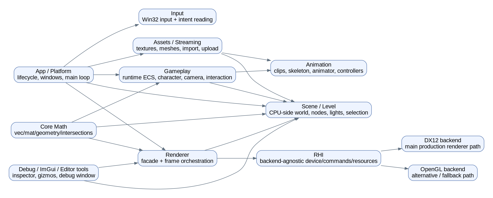

# CoreEngine — project overview (top level)

## How to read this documentation

This document captures the **top-level architecture** of the project in its current state.

1. show **which major parts the engine consists of**;
2. explain **how those parts connect to each other**;
3. capture the **data flow and frame update order**;
4. provide a stable foundation for follow-up documents that will deep-dive into each subsystem.

This document is intentionally written as an **entry point** into the rest of the documentation set.

---

## Top-level diagram

[Diagram here: high-level architecture of the whole project — App / Input / Gameplay / Scene / Assets / Renderer / RHI / DX12 / OpenGL]

Below is a starter Graphviz DOT block for the first top-level SVG diagram:

[Screenshot here: main engine viewport]
[Screenshot here: debug window / ImGui inspector]

---

## 1. What the project is

CoreEngine is a **custom modular real-time engine / renderer** built around the following ideas:

- modern C++ with modules (`.ixx`, `.cppm`);
- a custom rendering abstraction layer (**RHI**);
- multiple rendering backends (the archive clearly shows **DirectX 12** - the main right now - and **OpenGL**);
- CPU-side world representation through `Scene`, `LevelAsset`, `LevelInstance`, and an ECS layer;
- a dedicated gameplay runtime synchronized with the scene;
- a custom math layer and custom geometry/intersection algorithms;
- an asset loading, importing, and streaming pipeline;
- editor/debug tooling through ImGui, gizmo tools, and debug rendering.

Important: in the current state, the **rendering side is the largest subsystem**, and the DX12 branch is the primary working path. 
OpenGL is present, but architecturally is an alternative backend than the main focus going forward.

---

## 2. Project map by subsystem

### 2.1 App / Platform

**Purpose:** application lifecycle, windows, main loop, subsystem initialization, editor/game mode switching.

**Key files:**

- `src/main.cpp`
- `src/App/AppLifecycle.*`
- `src/App/AppBootstrap.*`
- `src/App/Win32AppShell.*`
- `src/App/DebugUiHost.*`
- `src/App/EditorViewportInteraction.h`

**What this subsystem does:**

- creates windows and swapchains;
- creates the rendering device;
- initializes AssetManager, Level, Renderer, GameplayRuntime;
- drives the main frame loop;
- updates editor interaction and gameplay mode;
- shuts the app down and releases resources cleanly.

This is an **orchestration layer**, not the place where rendering or gameplay logic itself lives. It is the layer that wires the rest of the engine together.

[Screenshot here: app start-up with main viewport and debug window]

---

### 2.2 Core

**Purpose:** base utilities and the shared API layer that other subsystems build on.

**Key parts:**

- `Core.ixx` — top-level aggregate module;
- `Core/Math` — math subsystem;
- `Core/Hash` — hash utilities.

Core is the foundation that gameplay, scene, renderer, and the asset pipeline depend on.

---

### 2.3 Math / Geometry

**Purpose:** custom vectors, matrices, transforms, camera math, geometric primitives, and intersections.

**Key files:**

- `src/Core/Math/MathUtils.cppm`
- `src/Core/Math/Geometry.cppm`

**What is already presented at the top level:**

- custom `Vec2`, `Vec3`, `Vec4`, `Mat4`;
- a column-major convention compatible in spirit with the earlier GLM-style approach;
- base operations such as dot, cross, normalize, lerp;
- matrix transforms: translate / rotate / scale / camera transforms;
- geometric primitives such as `Ray`;
- math used directly in `Transform`, camera, picking, visibility, animation, and gameplay movement.

  **All of these could be changed to some library analog a bit later.**

**Why this is critical for the documentation:**

[Diagram here: Math -> Scene / Picking / Visibility / Animation / Gameplay]
[Screenshot here: object picking ray / gizmo selection]

---

### 2.4 Input

**Purpose:** read user input and convert it into more useful, higher-level intent/state data.

**Key files:**

- `src/Input/Input.cppm`
- `src/Input/InputCore.cppm`
- `src/Input/ControllerBase.cppm`
- `src/Input/Win32Input.cppm`
- `src/Gameplay/Input/GameplayInput.cppm`

**Input layers:**

1. low level: Win32 input state;
2. a more abstract input utility layer;
3. a gameplay intent layer where buttons and axes become `moveX/moveY/run/jump/attack/interact`.

This matters because input in the project is **not hardwired directly into gameplay logic**. It is translated into intent components and commands, which are then consumed by the gameplay runtime.

---

### 2.5 Timer

**Purpose:** frame timing and delta-time control.

**Key files:**

- `src/Timer/GameTimer.ixx`
- `src/Timer/GameTimer.cppm`

**Role in the project:**

- frame time measurement;
- limiting overly large delta after stalls;
- passing `deltaSeconds` into animation, particles, gameplay, and rendering-related updates.

---

### 2.6 ECS

**Purpose:** helper layer around EnTT.

**Key file:**

- `src/ECS/EnTTHelpers.cppm`

At the top level, ECS is clearly used **not as the only representation of the whole world**, but as a **runtime gameplay/container layer** tied to level/scene data. That is an important architectural decision: the project looks like a **hybrid architecture**, not a pure “everything is ECS” design.

---

### 2.7 Assets / Resource Management / Streaming

**Purpose:** loading, decoding, importing, caching, and streaming textures and meshes.

**Key files:**

- `src/Assets/AssetManager.cppm`
- `src/Assets/ResourceManager.ixx`
- `src/Assets/ResourceManager_core.cppm`
- `src/Assets/ResourceManager_texture.cppm`
- `src/Assets/ResourceManager_mesh.cppm`
- `src/Render/Decoders/TextureDecoderSTB.cppm`
- `src/Render/Model/AssimpLoader.cppm`
- `src/Render/Model/AssimpSceneLoader.cppm`
- `src/Render/Model/ObjLoader.cppm`

**What this subsystem does:**

- manages resource states (`Unloaded / Loading / Loaded / Failed`);
- separates CPU-side decoding from GPU upload;
- knows about both 2D textures and cubemaps;
- resolves external texture paths, including FBX-related cases;
- imports meshes, skeletons, and animation clips;
- uses a job system / upload queue for streaming.

**Architecturally, this is the bridge between the file system and runtime GPU/scene representation.**

[Diagram here: files -> decoder/importer -> ResourceManager -> AssetManager -> Scene/Renderer]
[Screenshot here: loading overlay / streaming progress]

---

### 2.8 Scene

**Purpose:** the CPU-side representation of what exists in the world and what the renderer must be able to draw.

**Key files:**

- `src/Render/Scene/Scene.cppm`
- `src/Render/Scene/SceneBridge.cppm`
- `src/Render/Scene/CameraController.cppm`
- `src/Render/Scene/Visibility.cppm`
- `src/Render/Scene/Picking.cppm`
- `src/Render/Scene/EditorGizmo.cppm`
- `src/Render/Scene/EditorRotateGizmo.cppm`
- `src/Render/Scene/EditorScaleGizmo.cppm`

**What Scene includes:**

- `Transform`;
- `Camera`;
- lights;
- materials and their parameters;
- draw items;
- debug rays;
- particles / emitters;
- editor gizmo state;
- selection/editor-related state;
- skinned animation runtime data.

Scene is the **main meeting point between gameplay, editor, and renderer**.

Gameplay writes into it indirectly through `LevelAsset` / `LevelInstance` / scene sync. The editor modifies it through gizmos and inspectors. The renderer reads it as the input for a frame.

---

### 2.9 Level / LevelInstance

**Purpose:** a serializable level description and a runtime level instance inside the scene.

**Key files:**

- `src/Render/Scene/Level.cppm`
- `src/Render/Scene/LevelECS.cppm`
- `src/Render/Scene/LevelECS_impl.cppm`
- `src/Render/Scene/SceneImpl/*`

**Responsibility split:**

- `LevelAsset` — level data that can be loaded/saved as JSON;
- `LevelInstance` — runtime bindings between level data and scene objects/resources.

**Why this is important:**

This is one of the central architectural axes of the project. The level system carries:

- node placement in the world;
- mesh/material/skinned-data binding;
- the connection between editor changes and runtime scene representation;
- the relationship gameplay entity ↔ level node ↔ scene entity.

[Diagram here: LevelAsset -> InstantiateLevel -> LevelInstance -> Scene]
[Screenshot here: level hierarchy / inspector / node selection]

---

### 2.10 Animation / Skeleton / Skinned Mesh

**Purpose:** represent skeletons, animation clips, skinning data, and runtime animation controllers.

**Key files:**

- `src/Render/Model/Skeleton.cppm`
- `src/Render/Model/AnimationClip.cppm`
- `src/Render/Model/SkinnedMesh.cppm`
- `src/Render/Animation/Animator.cppm`
- `src/Render/Animation/AnimationController.cppm`

**What lives here:**

- skeleton hierarchy;
- skinned vertex format;
- bone indices / weights;
- skinned mesh bounds;
- animation clips;
- animator state;
- animation controller asset/runtime;
- notifies, transitions, parameters, blend1D;
- root motion related control modes.

This subsystem is needed not only by rendering, but also by gameplay runtime, because gameplay:

- sends parameters into the animation controller;
- receives notify events back;
- synchronizes locomotion/combat/interaction state with animation.

[Diagram here: Skeleton + Clip + Controller + Animator + Gameplay bridge]
[Screenshot here: skinned character in scene]

---

### 2.11 Gameplay

**Purpose:** runtime simulation on top of the level and scene.

**Key files and packages:**

- `src/Gameplay/Gameplay.cppm`
- `src/Gameplay/GameplayWorld.cppm`
- `src/Gameplay/Input/GameplayInput.cppm`
- `src/Gameplay/Camera/GameplayFollowCamera.cppm`
- `src/Gameplay/Character/*`
- `src/Gameplay/Combat/CombatSystem.cppm`
- `src/Gameplay/Interaction/InteractionSystem.cppm`
- `src/Gameplay/Animation/*`
- `src/Gameplay/Graph/*`
- `src/Gameplay/Runtime/*`

**At the top level, gameplay includes:**

- its own gameplay components (`Transform`, `InputIntent`, `Motor`, `Locomotion`, `Action`, `AnimationNotifyState`, and others);
- a world/container for entities and components;
- character movement/control logic;
- follow camera logic;
- combat requests;
- interaction requests;
- gameplay graph / state machine logic;
- an animation bridge;
- synchronization back into level/scene.

**Important observation:** gameplay is already split into meaningful subsystems instead of being collapsed into a single “character class”. This makes it a very strong candidate for a whole series of focused documents:

- gameplay world;
- intent/commands;
- movement;
- gameplay graph;
- animation bridge;
- runtime frame pipeline.

---

### 2.12 Gameplay Runtime

**Purpose:** orchestrate gameplay systems within a frame and connect them to editor/game modes.

**Key files:**

- `src/Gameplay/Runtime/GameplayRuntime.cppm`
- `src/Gameplay/Runtime/GameplayRuntimeCommon.cppm`
- `src/Gameplay/Runtime/GameplayBootstrap.cppm`
- `src/Gameplay/Runtime/GameplaySceneSync.cppm`

**Typical per-frame order:**

1. `BeginFrame()` — clear transient state;
2. `PreAnimationUpdate()`:
   - bootstrap/runtime mode handling;
   - input intent update;
   - building commands;
   - combat/interaction request updates;
   - executing gameplay graphs;
   - movement update;
   - locomotion update;
   - syncing transforms back to the runtime scene;
   - pushing state into animation;
3. animation update in `Scene` / animation runtime;
4. `PostAnimationUpdate()`:
   - consume animation events/notifies;
   - feed notify/gameplay events back into gameplay graph/runtime.

This is one of the most important diagrams to produce later, because it explains **when each gameplay system actually runs**.

[Diagram here: Gameplay frame pipeline]
[Screenshot here: switching between Editor/Game mode and controlling a character]

---

### 2.13 Gameplay Graph

**Purpose:** a state/task/event-driven logic layer on top of the gameplay runtime.

**Key files:**

- `src/Gameplay/Graph/GameplayGraph.cppm`
- `src/Gameplay/Graph/GameplayGraphAssets.cppm`

**What is visible at the top level:**

- asset descriptions for layers, states, tasks, conditions, and transitions;
- parameter store / blackboard;
- per-frame events;
- runtime state for layers;
- trigger/bool/int/float/string parameters.

This is effectively a separate mini-framework on top of gameplay ECS/runtime.

---

### 2.14 Renderer Facade

**Purpose:** a single public rendering interface that hides backend-specific implementations.

**Key file:**

- `src/Render/Renderer.cppm`

**Core idea:**

- external code talks to `Renderer`;
- inside, the implementation is selected based on the device backend;
- the app layer does not need to know DX12/OpenGL frame details.

This is a very clean architectural boundary between `App` and `Render backend internals`.

---

### 2.15 RHI (Render Hardware Interface)

**Purpose:** abstraction over the underlying graphics API.

**Key files:**

- `src/Render/RHI.cppm`
- `src/Render/Render.ixx`

**What the RHI contains:**

- backend enum;
- abstract resource handles;
- descriptions for buffers, textures, input layouts, and pipeline state;
- a command model;
- swapchain/device abstraction;
- shared formats, topology, depth/stencil/blend/raster states.

**The RHI is the contract between the upper renderer layer and concrete backends.**

[Diagram here: Renderer -> RHI -> DX12 / GL]

---

### 2.16 RenderGraph

**Purpose:** declarative / semi-declarative organization of frame resources and passes.

**Key file:**

- `src/Render/RenderGraph.cppm`

At the top level, RenderGraph clearly describes:

- resources;
- their usage/attachments;
- pass nodes;
- pass context/resources;
- an execution graph.

This is one of the subsystems that will need a dedicated dependency/pass-flow document later.

---

### 2.17 Render Core / Upload / Shaders / Support Systems

**Purpose:** shared rendering services.

**Key files:**

- `src/Render/RenderCore.cppm`
- `src/Render/Shader/ShaderFiles.cppm`
- `src/Render/Shader/ShaderSystem.cppm`
- `src/Render/Bindless.cppm`
- `src/Render/GpuMemory.cppm`
- `src/Render/Sync.cppm`
- `src/Render/FileSystem.cppm`

**What this includes:**

- shader library / cache;
- PSO cache;
- upload system;
- job systems;
- immediate render queue;
- bindless descriptors;
- GPU memory support;
- synchronization helpers;
- shader file/path utilities.

This is rendering infrastructure: it does not draw a frame by itself, but it supports almost every backend and render pass.

---

### 2.18 DX12 Backend

**Purpose:** the main production-like backend in the current project.

**Key files:**

- `src/Render/DirectX12/DirectX12Core.cppm`
- `src/Render/DirectX12/DirectX12RHI.cppm`
- `src/Render/DirectX12/DirectX12Renderer.cppm`
- `src/Render/DirectX12/DirectX12TextureUploader.cppm`
- `src/Render/DirectX12/DebugDrawRendererDX12.cppm`
- `src/Render/DirectX12/DebugTextRendererDX12.cppm`
- `src/Render/DirectX12/RHIImpl/*`
- `src/Render/DirectX12/RendererImpl/*`

**What is visible at the top level:**

The DX12 branch is split very thoroughly into meaningful implementation slices:

- device and capabilities;
- descriptors / root signatures;
- command submission;
- swapchain;
- ImGui integration;
- resource creation;
- frame pipeline, split into many `.inl` stages.

**What this includes:**

- shadow passes;
- pre-depth;
- main pass;
- deferred path;
- forward path;
- planar reflections;
- reflection capture;
- transparent / selection / debug / present;
- light upload and shared material helpers.

[Diagram here: DX12 renderer frame stages]
[Screenshot here: final frame with lights/shadows/reflections]
[Screenshot here: debug visualization render passes / RenderDoc frame capture]

---

### 2.19 OpenGL Backend

**Purpose:** alternative backend / fallback path.

**Key files:**

- `src/Render/OpenGL/OpenGLCore.cppm`
- `src/Render/OpenGL/OpenGLRHI.cppm`
- `src/Render/OpenGL/OpenGLRenderer.cppm`

I might be extened in one day - maybe not.

---

### 2.20 Debug / ImGui / Editor Tooling

**Purpose:** tools for development, debugging, and scene editing.

**Key files:**

- `src/Render/ImGui/ImGuiDebugUI.cppm`
- `src/Render/ImGui/ImGuiDebugUI_*.inl`
- `src/Render/Debug/DebugDraw.cppm`
- `src/Render/Debug/DebugText.cppm`
- editor gizmo files in `Scene`
- `App/DebugUiHost.*`

**What this includes:**

- debug UI;
- level hierarchy / inspector / file operations;
- light editor;
- reflection tools;
- renderer settings panels;
- debug draw / debug text;
- selection and gizmo manipulation.

This is a separate user-facing layer on top of the engine that helps inspect runtime state and edit the scene.

[Screenshot here: hierarchy panel]
[Screenshot here: inspector for light / material / node]
[Screenshot here: gizmo translate/rotate/scale]

---

### 2.21 Build System / Dependencies

**Purpose:** build the modular C++ project and pull third-party dependencies.

**Key file:**

- `CMakeLists.txt`

**What is visible at the top level:**

- CMake 3.30+;
- C++23;
- enabled C++ modules support;
- optional `import std;`;
- backend switch `GL / DX12`;
- dependencies: EnTT, STB, Assimp, ImGui docking branch, GLEW/GLFW/GLM for GL;
- separate `CoreEngineModuleLib` and executable `app`.

---

## 3. Main data flow in the project

### 3.1 From file to frame

At a high level, the path looks like this:

1. files on disk (`assets`, JSON level, mesh/texture/animation sources);
2. decoding/import through STB / Assimp / loaders;
3. ResourceManager / AssetManager;
4. runtime resource creation and GPU upload;
5. building `LevelInstance` and binding it into `Scene`;
6. gameplay runtime updates state;
7. animation runtime updates skinned state;
8. renderer reads `Scene` and builds a frame through RHI/backend.

[Diagram here: file-to-frame pipeline]

### 3.2 From input to character movement

1. Win32 input;
2. gameplay input bindings;
3. intent components;
4. character commands;
5. character movement + locomotion;
6. transform sync back into level/scene;
7. push animation parameters;
8. consume animation notifies back into gameplay.

[Diagram here: input-to-animation-to-gameplay feedback loop]

### 3.3 From editor interaction to scene update

1. viewport mouse interaction;
2. gizmo hover / selection / drag;
3. modifying `LevelAsset` / `LevelInstance` / scene state;
4. visual update and the next rendered frame.

---

## 4. Top-level per-frame order

In the current state of the project, the frame can be understood like this:

1. pump OS messages;
2. process resize;
3. asset streaming step;
4. timer tick;
5. input update;
6. editor mode logic **or** gameplay mode logic;
7. `GameplayRuntime::BeginFrame()`;
8. `GameplayRuntime::PreAnimationUpdate()`;
9. `Scene::UpdateSkinned(deltaSeconds)`;
10. `GameplayRuntime::PostAnimationUpdate()`;
11. update debug movement / particles;
12. build ImGui frame;
13. `Renderer::RenderFrame()`;
14. present / debug swapchain UI.

This is one of the main diagrams to start from when documenting the runtime in detail.

---
